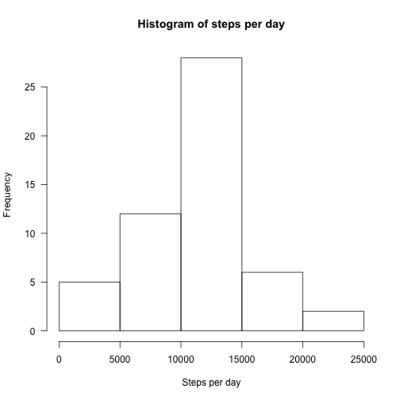
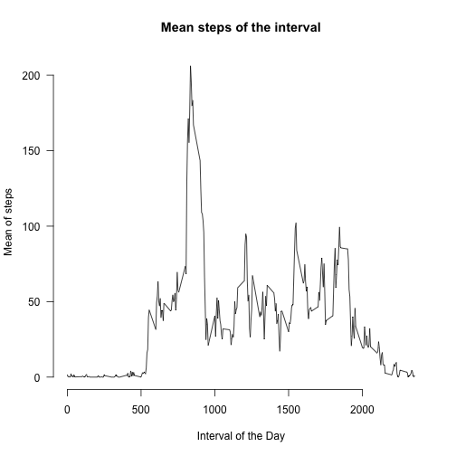
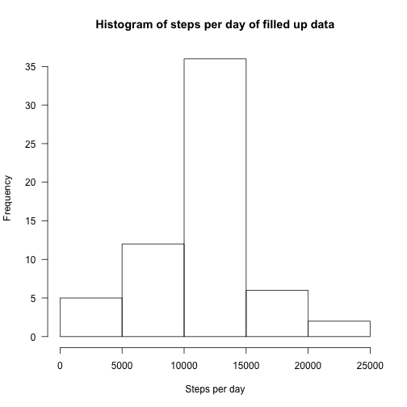
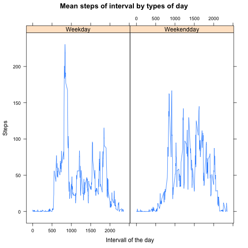

## Loading and preprocessing the data

In this part the data set for the whole report will be loaded and the date column will be transformed from factorc-olumn to a dates containing one. To show a first impression, the summary staistics of the data will be printed at the end. 

```r
data_set <- read.csv("activity.csv")
data_set$date <- as.Date(as.character(data_set$date), format = "%Y-%m-%d")
summary(data_set)
```

```
##      steps             date               interval     
##  Min.   :  0.00   Min.   :2012-10-01   Min.   :   0.0  
##  1st Qu.:  0.00   1st Qu.:2012-10-16   1st Qu.: 588.8  
##  Median :  0.00   Median :2012-10-31   Median :1177.5  
##  Mean   : 37.38   Mean   :2012-10-31   Mean   :1177.5  
##  3rd Qu.: 12.00   3rd Qu.:2012-11-15   3rd Qu.:1766.2  
##  Max.   :806.00   Max.   :2012-11-30   Max.   :2355.0  
##  NA's   :2304
```

## What is mean total number of steps taken per day?
In this section statistics for each day are created. Therefore the data is grouped per day and the number of steps are summed up. The head of the resulting data set is shown.

```r
day_steps <- aggregate(steps~date, data = data_set, FUN=sum)
head(data_set)
```

```
##   steps       date interval
## 1    NA 2012-10-01        0
## 2    NA 2012-10-01        5
## 3    NA 2012-10-01       10
## 4    NA 2012-10-01       15
## 5    NA 2012-10-01       20
## 6    NA 2012-10-01       25
```

Now I histogram of the steps per day will be shown. 


```r
hist(day_steps$steps, xlab = "Steps per day", main = "Histogram of steps per day", axes = FALSE)
axis(1)
axis(2, las=2)
```



The **mean** number of steps taken per day is calculated in the following: 

```r
mean_day <- mean(day_steps$steps)
print(mean_day)
```

```
## [1] 10766.19
```

The **median** of steps taken per day is:

```r
median_day <- median(day_steps$steps)
print(median_day)
```

```
## [1] 10765
```

## What is the average daily activity pattern?

In this section the 5-minutes intervalls are analyzed.  
At first there will be a plot about the mean of the steps taken in the intervalls.  
Therefor the data needs be aggregated in a different way, the head of the new aggregation will be diplayed along with the code.  


```r
interval_means <- aggregate(steps~interval, data = data_set, FUN = mean, na.rm=TRUE)
head(interval_means)
```

```
##   interval     steps
## 1        0 1.7169811
## 2        5 0.3396226
## 3       10 0.1320755
## 4       15 0.1509434
## 5       20 0.0754717
## 6       25 2.0943396
```

Now a plot, of the mean against the intervall is created. 

```r
plot(interval_means$interval, interval_means$step, type = 'l', ylab = "Mean of steps", xlab= "Interval of the Day", main= "Mean steps of the interval", axes=FALSE)
axis(1)
axis(2, las=2)
```



The interval with the maximum mean of steps is the foloowing one: 

```r
max_mean <- max(interval_means$steps)
max_interval <- interval_means[(interval_means$steps == max_mean),]
print(max_interval$interval)
```

```
## [1] 835
```
## Imputing missing values

In this section it is taken care of the **NA** Values.  
Threfore the number of rows containing any **NA** value is counted at first. 


```r
na_rows <- apply(apply(data_set, c(1,2), is.na),1, any)
sum(na_rows)
```

```
## [1] 2304
```

Now I check in which of the columns do **NA** Values occour. 


```r
na_cols <- apply(apply(data_set, c(1,2), is.na),2, any)
na_cols
```

```
##    steps     date interval 
##     TRUE    FALSE    FALSE
```

Accourding to the result, they just occor in the first column, which is about the steps. 
In order to fill the empty value I suggest the following approach.  
Since the mean of the intervals was already calculated, I will use that one. But since the mean is a real value and not an interger, I will use the rounded value to fill in missing values.  
1. I will create a data.frame containing for each interval the step value which will be entered.
2. I will replace the NA values in the originial data set, with the help of the data.frame cretaed in the first step. This will happen in two steps
        a. I split the original data.frame in the part which contains all the **NA** and a part without **NA**
        b. The data.frame with the **NA** Values I will join with the data.frame from step 1
        c. I will rbind both dataframes to one. 


```r
# Step 1:
#########
na_fill_values <- interval_means
na_fill_values$steps <- as.integer(round(interval_means$steps))

# Step 2:
#########
# Part a: 
#########
na_data_set <- data_set[(na_rows),]
non_na_data_set <- data_set[(!na_rows),]

# Part b:
#########
filled_part <- merge(na_data_set, na_fill_values, by='interval')[,c("interval", 'date', 'steps.y')]
names(filled_part) <- c("interval", "date", "steps")

# Part c:
#########
filled_data_set <- rbind(filled_part, non_na_data_set)
```

For the filled data.frame the summary will be shown now to prove there are no **NA** values in anymore. 

```r
summary(filled_data_set)
```

```
##     interval           date                steps       
##  Min.   :   0.0   Min.   :2012-10-01   Min.   :  0.00  
##  1st Qu.: 588.8   1st Qu.:2012-10-16   1st Qu.:  0.00  
##  Median :1177.5   Median :2012-10-31   Median :  0.00  
##  Mean   :1177.5   Mean   :2012-10-31   Mean   : 37.38  
##  3rd Qu.:1766.2   3rd Qu.:2012-11-15   3rd Qu.: 27.00  
##  Max.   :2355.0   Max.   :2012-11-30   Max.   :806.00
```

Now the same statistics as in the first section are calculated again. 
First the sum of the day in the filled data set. This time the head is not shown.

```r
filled_day_steps <- aggregate(steps~date, data = filled_data_set, FUN=sum)
```

Second the plot is recreated with the filled data.


```r
hist(filled_day_steps$steps, xlab = "Steps per day", main = "Histogram of steps per day of filled up data", axes = FALSE)
axis(1)
axis(2, las=2)
```



In this new data set the **mean** of steps per day is: 

```r
mean_day <- mean(filled_day_steps$steps)
print(mean_day)
```

```
## [1] 10765.64
```

The **median** of steps taken per day in the filled up data is:

```r
median_day <- median(filled_day_steps$steps)
print(median_day)
```

```
## [1] 10762
```

## Are there differences in activity patterns between weekdays and weekends?

In this part it is checked wether there is a difference between the **weekday** and **weekendday**. Therefore a new factor is created at first. 


```r
# Creating new column
#############################
filled_data_set$dayType <- weekdays(filled_data_set$date)

# Replacing Weekdaynames
#############################
filled_data_set$dayType <- sapply(filled_data_set$dayType,
                                  gsub,
                                  pattern="Monday|Tuesday|Wednesday|Thursday|Friday",
                                  replacement="Weekday")
filled_data_set$dayType <- sapply(filled_data_set$dayType,
                                  gsub,
                                  pattern="Saturday|Sunday",
                                  replacement="Weekendday")

# Making it a factor
#############################
filled_data_set$dayType <- as.factor(filled_data_set$dayType)
```

Now the different behaviors are plotted. There for at first the mean amoung the different factor levels are calculated and afterwards plotted. All this will happen in the following part. 


```r
# Calculation:
##############
mean_steps_daytype <- aggregate(steps~dayType + interval, data = filled_data_set, mean)

# Plotting:
##############
require(lattice)
xyplot(steps~interval|dayType, data=mean_steps_daytype, type='l', xlab="Intervall of the day", ylab="Steps", main="Mean steps of interval by types of day")
```


